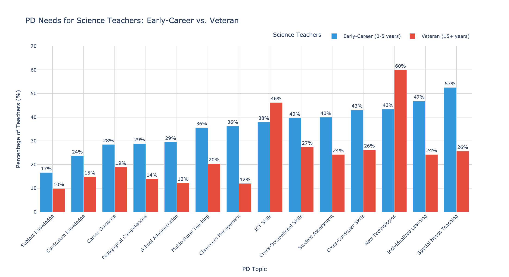

# Teacher Professional Development Analysis
**Career Stage Matters More Than Subject Area**

---

## Overview

This project analyzes professional development barriers and needs among U.S. middle school teachers using TALIS 2018 data. The analysis reveals that veteran and early-career science teachers face fundamentally different challenges—requiring differentiated programming approaches.

**Key Insight:** A 28% gap exists for both groups, but the *nature* of the gap differs completely. Veterans need technology training but lack incentives. Early-career teachers need classroom skills but lack time.

---

## Project Structure
```
├── notebooks/                   # Full analysis (3 Jupyter notebooks)
│   ├── 01_barriers_analysis.ipynb
│   ├── 02_needs_analysis.ipynb
│   └── 03_integration_analysis.ipynb
├── outputs/figures/             # Visualizations
├── executive_summary.md         # One-page summary
├── requirements.txt             # Python dependencies
└── data/README.md               # Data source documentation
```

---

## Key Findings

### Veteran Science Teachers (15+ years)
- **Need:** Technology integration (60%)
- **Barrier:** No incentives (28%)
- **Recommendation:** Provide stipends, flexible formats, virtual options

### Early-Career Science Teachers (0-5 years)
- **Need:** Classroom management, special needs strategies (53%)
- **Barrier:** Schedule conflicts (49%)
- **Recommendation:** Job-embedded PD, protected time, coaching/mentoring

### Science vs. Other Subjects
Science teachers face *fewer* structural barriers than other subjects (-8.4pp for employer support, p<0.001), suggesting schools prioritize STEM teacher development.

---

## Sample Visualizations

### PD Needs by Career Stage


*Sorted by early-career needs (low to high). The inverse pattern shows veterans and early-career teachers have opposite priorities.*

### Critical Gaps Analysis


*Quadrant analysis showing which need-barrier combinations affect each experience level most.*

---

## Methodology

**Data:** TALIS 2018 U.S. middle school teacher sample (n=1,806)  
**Analysis:** Descriptive statistics, chi-square tests (α=0.05), needs-barriers integration matrix  
**Tools:** Python (pandas, numpy, scipy), Plotly  
**Focus:** Science teachers by career stage (0-5 years vs. 15+ years)

---

## Technical Details

### Installation
```bash
pip install -r requirements.txt
```

### Dependencies
- pandas
- numpy
- plotly
- scipy
- pyreadstat (for SPSS files)

### Data Access
Raw data not included due to size. Download from [OECD TALIS](https://www.oecd.org/education/talis/).

---

## About This Project

This analysis was completed as part of my transition into data analytics, demonstrating statistical analysis, data visualization, and translating research into actionable recommendations.

**Author:** Charlie Kalish  
**Connect:** [LinkedIn] | [Email]  

---

## License

MIT License | Data: OECD TALIS 2018

---

*This project was completed with AI assistance (Claude) to establish methodology, which I am working to replicate independently as part of my learning process.*