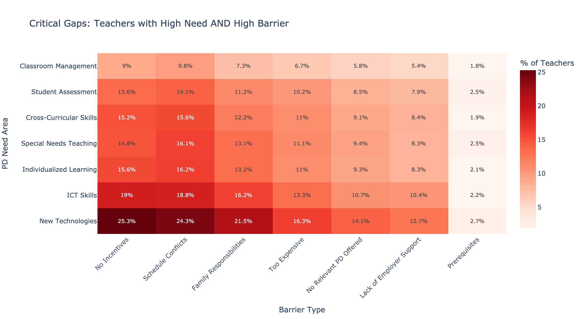
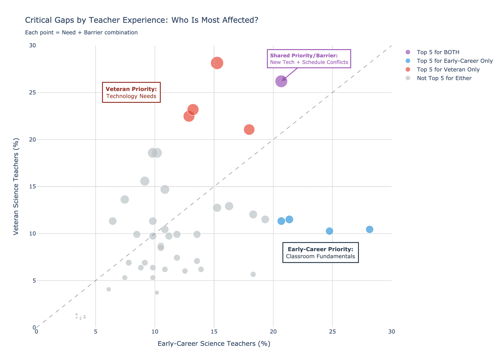

# Teacher Professional Development Analysis

## Project Purpose
The purpose of this project is to demonstrate my ability to analyze survey data sets and generate actionable insights. I chose professional development data in the educational field because:
(1) this is an area where public data is easily accessible
(2) it is an area with which I am myself experienced, having worked in education and professional development for 10+ years
(3) I have led numerous professional development trainings, albeit not in K-12 education, but in the food industry as a food safety trainer and expert on regulatory compliance
(4) This is the kind of data set I have often encountered over the course of my professional career.
---

## TALIS 2018 Analysis: Teacher Professional Development Gaps

This analysis examines U.S. middle school teacher PD with a specific focus on science teachers:

1. **Overall landscape** - What are the most common PD needs and barriers among all teachers?
2. **Science teacher comparisons** - Do science teachers face different needs and barriers than other subjects? How do these differ by career stage (early-career, mid-career, veteran)?
3. **Critical gaps for science teachers** - Where do high needs meet high barriers for science teachers specifically?

**Sample:** 1,799 middle school teachers (grades 7-9) with complete data

**Key Finding:** Career stage drives different critical gaps for science teachers. Veterans need technology training but lack incentives (28% gap). Early-career teachers need classroom fundamentals but lack time (28% gap).

---

## Project Structure
```
├── notebooks/                          # 3 Jupyter notebooks
│   ├── 01_barriers_analysis.ipynb      # What prevents PD access
│   ├── 02_needs_analysis.ipynb         # What PD teachers need
│   └── 03_integration_analysis.ipynb   # Critical gaps analysis
├── outputs/figures/                    # 10 visualizations
├── executive_summary.md                # One-page summary
└── requirements.txt                    # Python dependencies
```

---

## Visualizations


*Need-barrier combinations affecting most teachers*


*Different gaps for veterans (red) vs. early-career (blue)*

---

## Technical Setup
```bash
# Install
pip install -r requirements.txt

# Dependencies
pandas, numpy, plotly, scipy, pyreadstat
```

**Data:** Download [TALIS 2018](https://www.oecd.org/education/talis/) and place in `data/raw/`

**Methodology:** Descriptive statistics, chi-square tests (α=0.05), needs-barriers matrix

---

## About

**Charlie Kalish** | charliekalish@gmail.com | [LinkedIn](https://www.linkedin.com/in/charlie-kalish/)

**Career Transition:** Education, Regulatory compliance → Data analytics  
**Target Roles:** Program Manager, Data Analyst, Operations analyst 

---

**License:** MIT | **Data:** OECD TALIS 2018