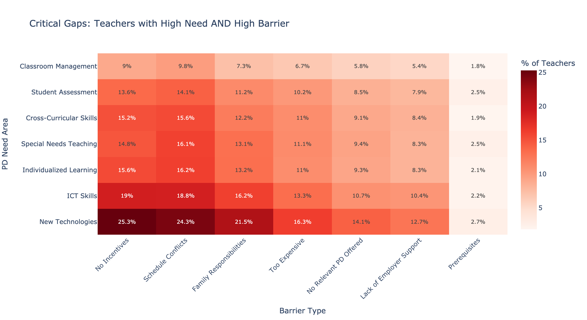

# Critical Gaps in Teacher Professional Development

## Purpose

Understanding teachers' Professional Development (PD) needs and the barriers that prevent them from accessing PD is critical for designing effective PD programs. Using [TALIS survey data](https://www.oecd.org/education/talis/) (2018), this analysis identifies key PD barriers and needs of U.S. Grades 6-9 science teachers to provide science education organizations with a national baseline with which to:

- Assess whether current programs address critical gaps (high need + high barrier)
- Drive allocations of resources to highest-impact interventions

---

## Key Findings

### Overall Summary

Of 1,422 science teachers who responded to survey, the largest percentage of respondents reported integration of new technologies as PD area of highest need with lack of incentives, schedule conflicts and family responsibilities as chief barriers.

*Critical Gaps: Teachers with High Need AND High Barrier*

However, sorting responses by career stage reveals sharp differences: early-career (0-5 yrs) and veteran (15+ yrs) teachers face fundamentally different critical gaps, with mid-career teachers falling in between.

---

### Critical Gaps Vary According to Career Stage

While early-career and veteran science teachers report similar PD needs overall, examining the top 5 most critical need-barrier combinations reveals sharp differences. A critical gap exists when teachers report BOTH needing specific training AND facing a barrier that prevents access. The chart below shows these combinations, revealing that veterans and early-career teachers face fundamentally different challenges.

*Colored bubbles = top 5 most severe gaps for each group*

**Veteran Science Teachers** struggle most with integrating new technologies; report a lack of incentives as principal barrier

**Early-Career Science Teachers** struggle most with classroom fundamentals (special needs strategies, individualized learning, classroom management); report scheduling conflicts as principal barrier.

---

## Recommendations

PD programs can maximize impact by tailoring offerings to the distinct needs and barriers of each career stage.

**Veteran Science Teachers:**
- Develop strategies that focus on incentivizing training in new technologies while accommodating busy schedules and family responsibilities

**Early-Career Science Teachers:**
- Offer flexible programs that will allow teachers to develop foundational classroom skills around their schedules

**Universal Strategies:**
- Offer shorter, focused sessions on specific skills (special needs strategies, differentiation)
- Create peer support networks that facilitate coaching, mentoring, and peer observation

---

**Author:** Charlie Kalish | charliekalish@gmail.com | [LinkedIn](your-linkedin-url)  
**GitHub:** [github.com/charliekalish/Talis-2018-teacher-pd-analysis](https://github.com/charliekalish/Talis-2018-teacher-pd-analysis)